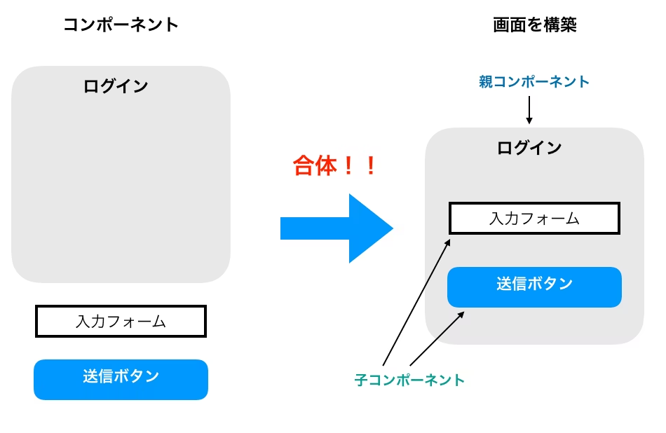

# npmコマンド
jsベースで作成する場合は
`npx create-react-app プロジェクト名`
typescriptベースで作成するときは
`npx create-react-app プロジェクト名 --template typescript

# ローカルサーバー起動
`npm starrt`

# create-react-app時のファイル・ディレクトリ構成

  - ## そもそも推奨されるディレクトリ構成はない
    自由度が高く、公式でもそこまで考えなくてもいいと書いてあるらしい。
  
  - ## node_modules
    ライブラリの実態が入る場所。pythonで言うところの.venvフォルダ
  
  - ## publicフォルダ
    静的ファイル（HTML CSS、画像等の置き場所）
  
    - ### index.HTML
  アプリの土台となるhtmlファイル。reactはこの中の ```html <div id="root"></div>``` に描画される
  
  - ## src
    tsx(jsベースの場合はjsx)コードの置き場所
  
    - ### そもそもtsx/jsxとは
        javascript, typescript野中にhtmlを直接記述できる構文拡張
        最終的にbabelなどのツールでjavascript, typescriptに変換されて実行される
  
    - ### コンポーネント
        jsx/tsxの関数として定義される、画面のパーツ
        コンポーネントの例：
        ```tsx
        // 関数部分がコンポーネント
        function Practice() {  //関数名の先頭は大文字
            return <h1>Reactの練習</h1>;　//関数で定義するJSXを関数コンポーネント
        }
        
        
        
        関数部分をHTMLとしてレンダリング
        root.render(<Practice />);
        ```
        
    
    - ### app.tsx
        アプリのメイン画面を構成するコンポーネントを集めたファイル
        
    
    - ### index.tsx
        index.htmlに対して、app.tsxにあるコンポーネントの中からどれを流し込むかを決めるところ
        reactは基本的にflaskなどと違い、SPA(single page application)なので、index.htmlに対してどのコンポーネントを流し込むかで表示内容を決める。
        - index.tsxの中身
            ```tsx
            // 1. 必要な道具をインポート
            import React from 'react';
            import ReactDOM from 'react-dom/client';
            import App from './App';

            // 2. HTML側にある "root" という箱を特定する
            const root = ReactDOM.createRoot(
            document.getElementById('root') as HTMLElement
            );

            // 3. その箱の中に、Appコンポーネントを描画する
            root.render(
            <React.StrictMode>
                <App />
            </React.StrictMode>
            );
            ```
    - ### react-app-env.d.tsx
        typescriptの型定義に関するファイル 基本ノータッチでOK
    - ### package.json
        プロジェクト内でつs買っているライブラリ屋起動コマンドなどの定義
    - ### tsconfig.json
        typescriptの設定ファイル コンパイルのルール等が書かれているらしい

# typescript
  - ## 変数宣言子
    | 演算子 | 役割 |
    | ---- | ---- |
    | var(ほぼ使われない) | 関数外からはアクセスできない変数 |
    | let | {} =if文などのブロックスコープ外からアクセスできない変数 |
    | const | 定数 |
  - ## typescript : 静的型付け
    ```typescript
    # 変数演算子 変数名 : データ型 = データ
    let mojiretsu : String = "ricky"
    ```

  - ## 論理演算子
    | 演算子 | 役割 | コード例 | 結果例 |
    |---|---|---|---|
    | `&&` | AND（両方が true のとき true） | `true && false` | `false` |
    | `\|\|` | OR（どちらかが true なら true） | `true \|\| false` | `true` |
    | `!` | NOT（真偽を反転） | `!true` | `false` |
    | `&&` | 左が true の場合 右を実行する（短絡評価） | `true && func()` | `func()` は実行される |
    | `\|\|` | 左が falseの場合 右を実行する（短絡評価） | `flase \|\| func()` | `func()` は実行される |
    | `??` | 左がnullの時に右の値を返す | `null ?? "default"` | `"default"` |
  - ## 比較演算子
    | 演算子 | 役割 | コード例 | 結果例 |
    |---|---|---|---|
    | `==` | 等しい（型変換あり） | `5 == "5"` | `true` |
    | `!=` | 等しくない（型変換あり） | `5 != "5"` | `false` |
    | `===` | 厳密に等しい（型・値ともに一致） | `5 === "5"` | `false` |
    | `!==` | 厳密に等しくない | `5 !== "5"` | `true` |
    | `>` | より大きい | `10 > 5` | `true` |
    | `<` | より小さい | `3 < 7` | `true` |
    | `>=` | 以上 | `5 >= 5` | `true` |
    | `<=` | 以下 | `4 <= 6` | `true` |
    | `? :` | 条件演算子（三項演算子） | `score >= 60 ? "合格" : "不合格"` | `"合格"` |
  - ## typescriptのデータ型
    [typescriptのデータ型](https://qiita.com/Im0_3/items/2ebbee06b8ca293e26ba)
    - ### str:文字列
      まああれだ 文字列だ 
      ```typescript
      const nickname : string = "ricky"
      console.log(nickname)
      ```
      - #### 文字列の結合
        ```typescript
        const firstname : string = "chikara"
        const lastname : string = " yoshida"

        console.log(firstname + lastname)
        // chikara yoshida
        ```
      - #### 文字列中のデータの埋め込み
        pythonで言うところのf記法
        ```typescript
        const firstname : string = "chikara"

        console.log("私の名前は${ firstname }です。")
        // 私の名前はchikaraです
        ```
      - #### 文字列の代表的なメソッド
        <details><summary>文字列の代表的なメソッド</summary>
        

          <h4> ①str.includes(文字列)：特定の文字列が含まれるかどうか ー＞bool</h4>
          <pre>
          <code class='language-javascript'>
          const firstname : string = "chikara"
          console.log(firstname.includes("chi"))
          // true
          </code>
          </pre>

          <h4> ②startsWith: 特定の文字で始まるかどうか ー＞ bool</h4>
          <pre>
          <code class='language-javascript'>
          const firstname : string = "chikara"
          console.log(firstname.startsWith("chi"))
          // true
          </code>
          </pre>

          <h4> ③endsWith: 特定の文字で終わるかどうか ー＞ bool</h4>
          <pre>
          <code class='language-javascript'>
          const firstname : string = "chikara"
          console.log(firstname.endsWith("ra"))
          // true
          </code>
          </pre>

          <h4> ④indexOf: 特定の文字が何番目にあるか ー＞ number</h4>
          <pre>
          <code class='language-javascript'>
          const firstname : string = "chikara"
          console.log(firstname.endsWith("ka"))
          // 3
          </code>
          </pre>

          <h4> ⑤padStart(桁数, パディングする文字): 文字列の桁数を合わせるて左側を埋める ー＞ string</h4>
          <pre>
          <code class='language-javascript'>
          const firstname : string = "chikara"
          console.log(firstname.padStart(10, "-"))
          // ---chikara
          </code>
          </pre>

          <h4> ⑥padEnd(桁数, パディングする文字): 文字列の桁数を合わせるて右側を埋める ー＞ string</h4>
          <pre>
          <code class='language-javascript'>
          const firstname : string = "chikara"
          console.log(firstname.padEnd(10, "-"))
          // chikara---
          </code>
          </pre>

          <h4> ⑦replace(検索パターン, 置換する文字): 文字列の一部を入れ替える ー＞ string</h4>
          <pre>
          <code class='language-javascript'>
          const firstname : string = "ricky yoshida"
          console.log(firstname.replace("ricky", "ikemen"))
          // ikemen yoshida
          </code>
          </pre>

          <h4> ⑧slice(開始位置, 終了一): 文字列のスライシング ー＞ string</h4>
          <pre>
          <code class='language-javascript'>
          const firstname : string = "chikara"
          console.log(firstname.slice(3, 5))
          // ka
          </code>
          </pre>

          <h4> ⑧split(区切り文字): 分割して配列にする ー＞ string</h4>
          <pre>
          <code class='language-javascript'>
          const full_name : string = "chikara yoshida"
          console.log(full_name.split(" "))
          console.log(full_name.split(" ")[0])
          console.log(full_name.split(" ")[1])
          // [ 'chikara', 'yoshida' ]
          // chikara
          // yoshida
          </code>
          </pre>

          <h4> ⑧toUpperCase() / toLowerCase(): 大文字 / 小文字にする ー＞ string</h4>
          <pre>
          <code class='language-javascript'>
          const firstname : string = "chikara"
          const lastname : string = "YOSHIDA"

          console.log(firstname.toUpperCase())
          console.log(lastname.toLowerCase())
          // CHIKARA
          // yoshida
          </code>
          </pre>

        </details>
    - ### number: 数値
      - #### 四則演算
        ```typescript
            let number8 : number = 8
            let number10 : number = 10

            console.log(number5 + number8) // 13
            console.log(number5 - number8) //-3
            console.log(number5 * number10) //50
            console.log(number5 ** number8) //390625 べき乗
            console.log(number10 / number5)  //2  割り切れる場合は整数
            console.log(number8 / number5)  //割り切れない場合は小数
            console.log(number8 % number5)  //あまり

            //インクリメント系
            number5 ++ //1増やす
            number5 -- //1減らす

            number5 += 1 //指定の数増やして代入
            number5 -= 1 //指定の数減らして代入
            number5 *= 1 //指定の数かけて代入
            number5 /= 1 //指定の数で割って代入

        ```

      - #### number型の代表的なメソッド
    - ### bool : 真偽値
      - #### boolの代表的なメソッド
    - ### bigint : でかい数値
    - ### symbol: 一意で不変のデータ
    - ### null / undefined : 空のデータ
      - #### null / undefinedのユースケース
    - ### any : なんでもおＫなやつ
      - #### 基本的には使っちゃだめ
    - ### void：返り値を返さない関数の型
    - ### array:
    - ### enum:


